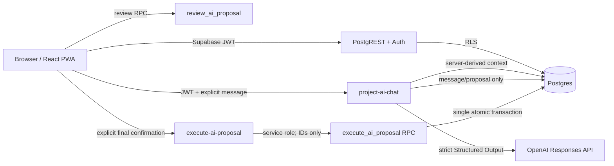

# reset HUB Final Architecture

## Runtime architecture

The browser never receives the OpenAI key or service-role key. Community, profile, session and membership are re-derived server-side. Approval does not execute. Execution requires a separate user action and a fixed action allowlist.

## Frontend

- React routes are lazy-loaded; Project AI remains a separate chunk.
- `AuthProvider` owns the Supabase session. `AuthGate` waits for both auth and workspace bootstrap.
- `StoreProvider` owns Tasks, Events, LINE Inbox and member workspace state.
- The PWA uses generated service-worker precaching and a standalone manifest.

## Project AI flow

1. Browser creates/selects its own conversation session.
2. `project-ai-chat` verifies JWT, session ownership and active membership.
3. The Function claims DB-backed profile/community rate limits.
4. Context is loaded server-side and bounded to 100 tasks, 50 goals, 50 KPIs, 50 events, 50 activities and 20 conversation messages.
5. OpenAI returns strict JSON Schema output.
6. The same canonical Zod action contract validates persistence and execution.
7. A proposal is saved as `proposal`; it is never auto-executed.

## Data model decision

`project = null` and `documents = []` remain intentional. Community scope currently matches the product. A project hierarchy or document ingestion pipeline would introduce ownership, retention, extraction and access-control decisions that are not yet specified. Add neither until concrete multi-project navigation or document-source requirements exist.
